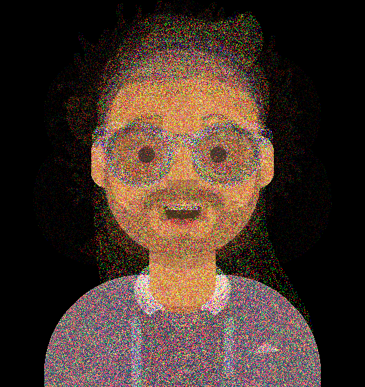

ДЗ 1. Байесовская генерация и автоэнкодеры

1. Был реализован генератор стилей на основе наивной байесовской модели для получения вероятностей комбинаций признаков
2. Был реализован генератор аватаров. Пример генерации аватара без применения аддитивного сглаживания:

Больше примеров в папке *self_made_avatars*

При добавлении аддитивного сглаживания получаем шумовое изображение (смотри ноутбук style_generation.ipynb).
Связано это с тем, что при аддитивном сглаживании мы даем шанс реализоваться каждой интенсивности от 0 до 255 с маленькой, но не нулевой вероятностью, а так как у нас всего 11 аватаров, для значительной части пикселей определенная интенсивность в определенном канале в датасета встречается один раз, поэтому для таких пикселей вероятность получить наблюдаемую интенсивность равна вероятности получить какую-то из 2 случайных ненаблюдаемых в датасете интенсивностей.

3. Был реализован классификатор пролив/непролив с помощью автоэнкодера с выбором порога для MSE.

Из изображений лунок вырезался центр, так как интуитивно кажется, что именно он покрывает область потенциального пролива, а не края изображения, где нет лунки.

Значения метрик:

* True positive rate: 77.52 %
* True negative rate: 97.9 %
* Precision: 56.5 %

PS. Курс Обработка и генерация изображений не проходил.
