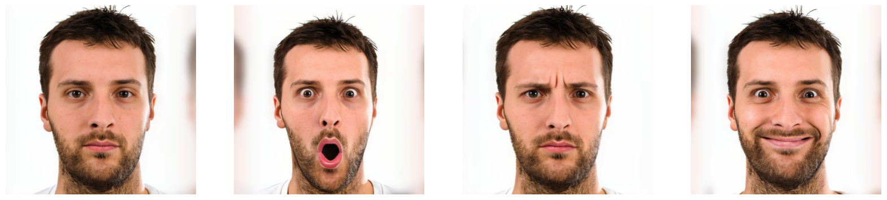

### ДЗ №3: Sampling в латентном пространстве StyleGAN

#### Датасет

Был собран датасет фотографий 4 знаменитостей (my_celebs):

* Бред Питт
* Илон Маск
* Роберт Дауни Младший
* Джефф Безоса

Для дальнейших экспериментов были взято по одному фото каждого из них.

#### Подготовительные работы

Были получены проекции изображений в пространстве StyleGAN 3 способами:

1. Обучение на комбинации лоссов
2. Использование энкодера
3. Обучение на комбинации лоссов + инициализация выходом энкодера

Генерации на основе проекций изображений:

 

Такой подход сглаживает все неровности кожи и морщины, омолаживая персонажей. Люди становятся мало похожи на себя.

 

2 Способ сильно лучше, энкодер сохранил некоторые следы старости и знаменитости в основном похожи на себя.

 

По сравнению с 1 способом получилось лучше только для Безоса. Качество хуже чем во 2 способе, поэтому будем использовать 2 способ для проекции оригинальных фото.

#### Style transfer

За основу были взяты следующие стили:

 

Пример переноса стиля на фото Бреда Питта с постепенным сохранением все больше числа оригинальных векторов латентного пространства.

Если изначально взять за основу вектора стилей, то заменяя в них вектора на вектора оригинального фото, сначала меняется угол наклона головы, затем меняется выражение и форма лица, и чем дальше мы идем, тем больше теряются черты стиля и приобретаются детали оригинального фото. Так как человек должен остаться похожим на себя, выглядит неплохим вариантом взять из стиля вектора с 9 по 18.

Перенос стиля на Бреда Питта:

#### Expression transfer

За основу были взяты следующие эмоции:

Слева направно:

1. Нейтральное состояние
2. Удивление
3. Замешательство
4. Радость

 

Были протестированы различные lambda от 0 до 1 с шагом в 0.25.

Пример удивления Илона Маска

 

Пример радости Джеффа Безоса

Эмоции перенесены хорошо.

#### Face Swap

Пример переноса других лиц на лицо Бреда Питта:

Лица слева направо: Илон Маск, Роберт Дауни Младший, Джефф Безос.

Лица перенесены хорошо.

**Больше примеров смотри в ноутбуке hw3.ipynb или в colab по ссылке: https://colab.research.google.com/drive/1_uSPJs7eULCOIUJ5d4oESBY5bGKJj0NV?usp=sharing**

