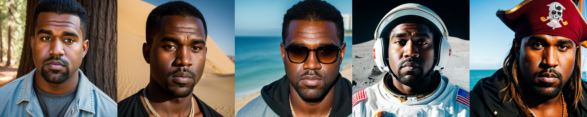
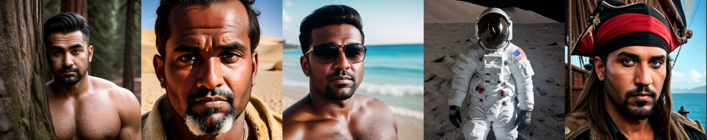
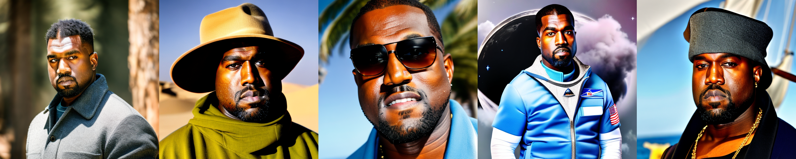
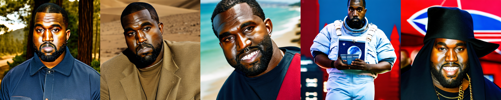
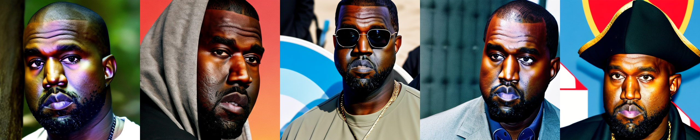
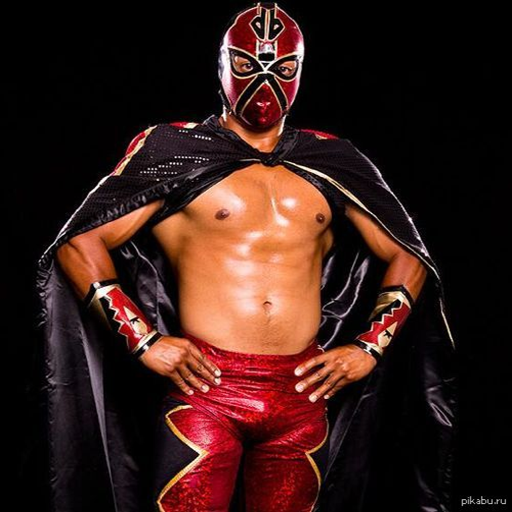
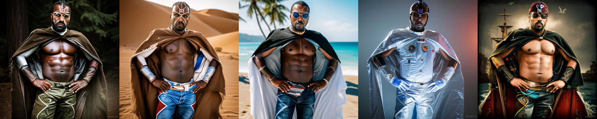
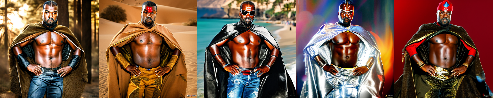

Домашнее задание № 4. Обучение Stable diffusion 1.5 методом Dreambooth.

Смотри в ноутбуке hw4.ipynb или по ссылке: https://colab.research.google.com/drive/12IVXk17r1eS5m_ehCQcD9O9sBnjJtlfJ?usp=sharing

Было собрано 20 фото Канье Веста и приведено к необходимому формату. 
Ознакомиться с фото можно по ссылке: https://drive.google.com/drive/folders/1nfixT_EdbdTltFUPsTyFpawdBF4qSQf3?usp=sharing

Был взят предобученный чекпоинт SD1.5 *CyberRealistic* (тот же, что использовался на занятии).

Для тестирования обученных моделей были подготовлены 5 промтов:

1. portrait of sks man face, in the forest, sequoias, fresh air, nature, standing, 4K, raw, hrd, hd, high quality, realism, sharp focus,  beautiful eyes, detailed eyes
2. portrait of sks man face, in the desert, sand, scorching, hot, standing, 4K, raw, hrd, hd, high quality, realism, sharp focus,  beautiful eyes, detailed eyes
3. portrait of sks man face, on the beach, black sunglasses, palms, sea, standing, 4K, raw, hrd, hd, high quality, realism, sharp focus,  beautiful eyes, detailed eyes
4. portrait of sks man face, on the moon, space, astronaut, lunar, standing, 4K, raw, hrd, hd, high quality, realism, sharp focus,  beautiful eyes, detailed eyes
5. portrait of sks man face, on the pirate ship, eye patch, pirate hat, ocean, standing, 4K, raw, hrd, hd, high quality, realism, sharp focus,  beautiful eyes, detailed eyes

### Unet

Результаты генерации обученного UNet (Канье в лесу, в пустыне, на пляже, Луне, пират):



### LoRA

Learning rate были повышен в 100 раз (с 2e-6 на 2e-4), так как при слишком маленьком lr генерировался не Канье, а другой человек:



Модель LoRA была обучена с 3 различными значениями параметра rank (4, 16, 64)

RANK = 4



RANK = 16



RANK = 64



Визуально кажется, что при увеличении ```rank``` качество ухудшается, так как фон перестает соответствовать промпту, и на лице появляются нереалистичные цветовые эффекты.
Сравнивая UNet и LoRA, мне показалось, что в первом случае модель лучше распознает контекст промта и генерирует более подходящий наряд персонажа и задний план, а во втором случае лучше генерируются различные планы (лицо, по пояс и т.д.)

### ControlNet

Попробуем представить Канье в виде лучадора:



### UNet + ControlNet



### LoRA + ControlNet



Кажется, что связка ControlNet + Unet справилась лучше, так как опять таки качественнее сгенерирован задний план и одежда. Особенно это заметно для изображений в стиле "на луне" и "пират".

